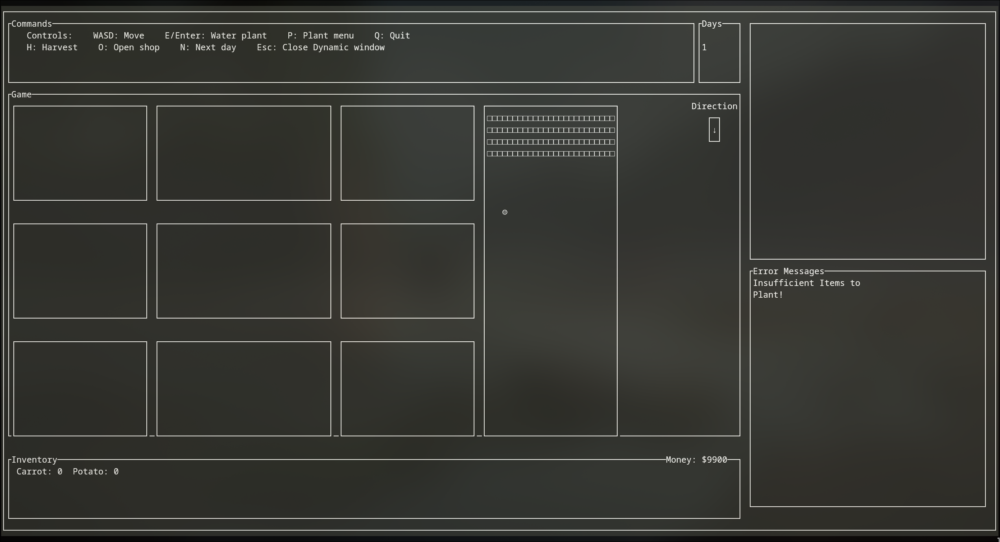
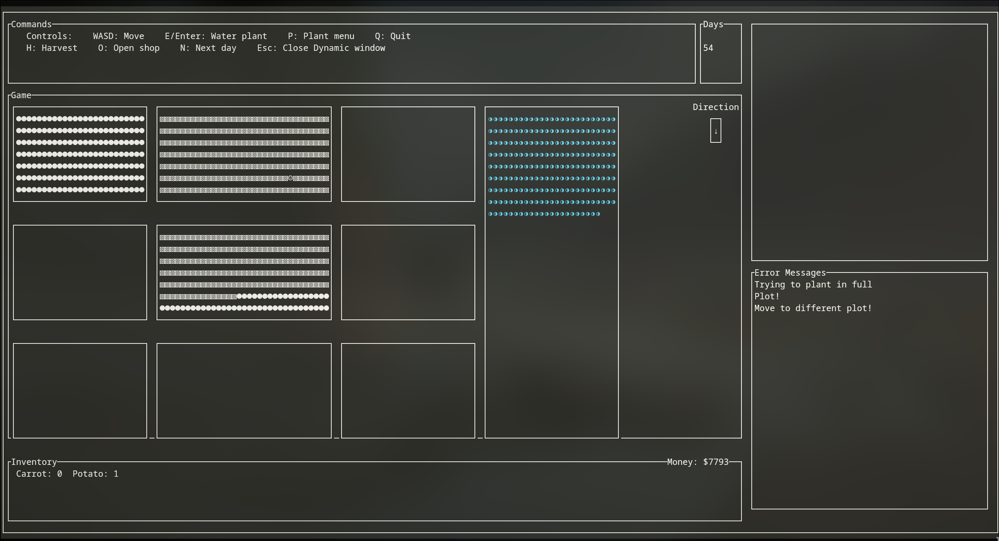

# Small Farm Game (Terminal-Based, ncurses)

A terminal-based farming simulation game developed in **one week** as a **group project for an Object-Oriented Programming (OOP) course**.  
The game runs entirely in the terminal using **ncurses**, featuring **keyboard-only input**, a dynamically updating UI, and a modular object-oriented architecture.

This project focuses on **object-oriented design, game state management, and real-time terminal rendering,** rather than graphical polish or completion of all planned features.


---

## Demo Video

A gameplay walkthrough and feature demonstration can be found here:

[](https://youtu.be/KpmkU_T9SuQ)

---

## Key Features

- Fully keyboard-driven gameplay (no mouse input)
- Real-time terminal UI rendered using **ncurses**
- Dynamic context-sensitive menu system that updates based on player actions
- Crop lifecycle simulation (plant → water → grow → harvest)
- Inventory and economy system (buying, selling, replanting)
- Dynamic context-sensitive menu system that updates based on player actions

---

## Gameplay Overview

- The game is launched from the terminal using `make`
- Player movement uses **WASD**
- All interactions are triggered via single-key inputs
- A **dynamic menu on the right-hand side** updates based on the current action:
  - Planting
  - Harvesting
  - Shop interaction
- Crops grow across multiple in-game days
- Time progresses by advancing the day (`N`)
- Harvested crops are added to the player’s inventory
- Items may be replanted or sold for money

There is no **explicit win condition**. The game functions as a sandbox-style simulation intended to demonstrate mechanics and system design.

---

## Active Controls

| Key | Action |
|----|-------|
| W / A / S / D | Move player |
| P | Open plant menu |
| E / Enter | Water plant |
| H | Harvest |
| O | Open shop |
| N | Advance to next day |
| Esc | Close dynamic window |
| Q | Quit game |

---

## How It’s Made

### Technologies
- **Language:** C++
- **UI Library:** ncurses
- **Build System:** GNU Make
- **Platform:** Unix-like terminals (Linux / WSL)

### Development Constraints
- **Total development time:** ~1 week
- **Team size:** 3
- Emphasis placed on:
  - Clean OOP structure
  - Input handling and UI clarity
  - Game state management under tight time constraints

### Design Approach
- The game was designed around clear object-oriented seperation:
  - Game states & Logic management
  - Rendering and input
  - World entities
  - Inventory and economy
  
- ncurses windows divide the terminal into distinct regions:
  - **Top:** Dynamic keybind display
  - **Center:** Game world (farm plots, player)
  - **Right:** Context-sensitive interaction windows (Planting, Shop, Harvesting, Errors)
  - **Bottom:** Inventory and money (always visible)

### Rendering
  - The screen is redrawn efficiently to avoid flicker
  - Only relevant UI components update when player input changes
  - Error messages and invalid actions are showin in dedicated UI regions

---

## Architecture Overview

The project follows a **modular object-oriented architecture**, with clear separation between game logic, rendering, input handling, and data models. Each major gameplay concept is represented as a class or small group of related classes.

### Source Structure
```
FarmGame/
│── src/                % Core C++ source files (game logic, entities, UI, manager)
│── tests/              % Unit tests (Google Test)
│── ncurses/            % Local ncurses build and headers
│── Media/              % Screenshots, demo images, videos
│── Documentation/      % Planning document and design notes
│── Makefile            % Build configuration
│── README.md
```

---

### Core OOP Systems

#### **GameManager**
- Owns the main game loop
- Handles:
  - Time progression (days)
  - Updating entities
  - Routing player input
  - Coordinating interactions between systems
- Acts as the central authority for game state

---

#### **Display**
- Responsible for **all ncurses rendering**
- Draws:
  - Game world (farm plots, player position)
  - Inventory and money
  - Dynamic context-sensitive menus
  - Command/keybind display
- Rendering is partitioned into fixed terminal regions to maintain clarity and prevent redraw conflicts

---

#### **Player**
- Tracks:
  - Position and facing direction
  - Money
  - Inventory
- Provides interaction methods for:
  - Planting
  - Watering
  - Harvesting
  - Buying and selling

---

#### **Inventory & Item**
- `Item` is a base abstraction for all buyable/sellable objects
- `Inventory` manages items using a map-based structure
- Acts as the bridge between:
  - World entities (plants)
  - Economic systems (shop)

---

#### **Entity Hierarchy**
- `Entity` is an abstract base class for all time-progressing objects
- Encapsulates:
  - Growth state
  - Maturity checks
  - Day progression logic

**Plants**
- `Plant` inherits from `Entity` and defines virtual growth and harvest behaviour
- `CarrotPlant` and `PotatoPlant` implement crop-specific logic such as:
  - Growth duration
  - Harvest yield

**Animals**
- `Animal` and `Cow` classes were partially implemented
- Designed to mirror the plant lifecycle model but were not completed within the one-week timeframe

---

#### **Plot System**
- `Plot` provides shared spatial and capacity management
- `FarmPlot` manages collections of plants and enforces capacity constraints
- Designed to support additional plot types (e.g. animal pens) with minimal changes

---

#### **Shop**
- Handles purchasing logic and price checks
- Interacts directly with the `Player` and `Inventory`
- Displays shop UI via the dynamic ncurses window

---

### Architectural Intent

The architecture was deliberately designed to:
- Emphasise **inheritance and polymorphism**
- Allow unfinished features (e.g. animals) to be added later
- Keep gameplay logic decoupled from rendering
- Remain manageable under a **one-week development constraint**

Despite limited scope, the structure supports extension without major refactoring.

### Core Design Concepts
- **Entity**: Abstract base class for time-progressing game objects
- **Plant**: Abstract crop entity with virtual growth/harvest behaviour
- **CarrotPlant / PotatoPlant**: Concrete plant implementations
- **Item**: Unified abstraction for all buyable/sellable objects
- **Inventory**: Map-based item storage system
- **GameManager**: Controls the main loop and time progression
- **Display**: Handles all ncurses-based rendering

The architecture was designed to support features such as animals and additional crops, even though they were not completed within the timeframe.

---

## Screenshots

**Gameplay Example:**



---

## Testing

- Unit tests planned and partially implemented using **Google Test**
- Tests focused on:
  - Inventory operations
  - Plot capacity constraints
  - Entity growth logic
  - Shop transactions
  - Input handling
- Runtime assertions and logging used for debugging
- Issues tracked and resolved during development

---

## Optimizations & Lessons Learned

### Optimizations
- Reduced redundant terminal redraws for improved responsiveness
- Centralized keyboard input handling
- Modularized entity behaviour to simplify future expansion

### Lessons Learned
- Strong upfront class design reduces pain when features are cut
- Terminal UIs require deliberate spatial planning
- Context-sensitive controls significantly improve usability
- ncurses is powerful but unforgiving under time pressure
- Clear ownership of classes is critical in short group projects

---

## Limitations & Future Work

- Only two crop types implemented (carrots and potatoes)
- Animal systems were designed but not completed
- No explicit win condition or end-game state
- Economy balancing is minimal

These limitations were the result of **time constraints**, not architectural issues.

---

## Building & Running

### Prerequisites
- Linux or WSL
- `g++` or `clang++`
- `make`

---

## Building ncurses (Local Install)

To compile **ncurses locally** (recommended for WSL), navigate to the ncurses install directory and run:
```bash
CC=clang CXX=clang++ ./configure \
  --prefix=/yourPathHere/FarmGame/ncurses \
  --enable-widec \
  --with-pthread \
  CFLAGS="-fPIC" \
  CXXFLAGS="-fPIC"
```

Then build and install: 
```bash
make -j16 \
make install
```

## Running the Game
```bash
make
```

## Acknowledgements
Developed as a group project for an Object-Oriented Programming course, with shared responsibility across system design, implementation, testing, and documentation.
